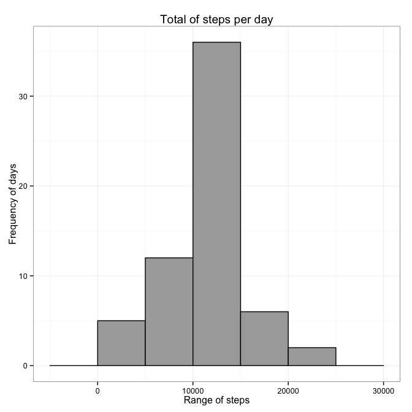
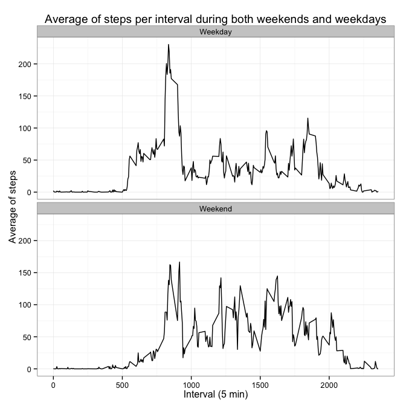

# Reproducible Research: Peer Assessment 1


## Loading and preprocessing the data
Show any code that is needed to

1. Load the data (i.e. read.csv())
2. Process/transform the data (if necessary) into a format suitable for your analysis

#### Answer:

```r
unzip(zipfile = "activity.zip")
Data <- read.csv("activity.csv")
```


## What is mean total number of steps taken per day?

For this part of the assignment, you can ignore the missing values in the dataset.

1. Calculate the total number of steps taken per day

2. If you do not understand the difference between a histogram and a barplot, research the difference between them. Make a histogram of the total number of steps taken each day

3. Calculate and report the mean and median of the total number of steps taken per day

#### Answer:
1.

```r
StepsPD <- aggregate(steps ~ date, data = Data, FUN = sum)
```

**Note:** Please note aggregate removes NA's by default.

2.

```r
library(ggplot2)
ggplot(data = StepsPD, aes(steps)) + geom_histogram(binwidth=5000, col = "black", fill = "dark grey") + theme_bw() + labs(x = "Range of steps", y = "Frequency of days", title = "Total of steps per day")
```

 

**Note:** The histogram gives the frequency or number of days which have a number of steps in some range. For example there are 5 days on which the number of steps lies between 0 and 5000.

3.

```r
mean(StepsPD$steps)
```

```
## [1] 10766.19
```

```r
median(StepsPD$steps)
```

```
## [1] 10765
```

## What is the average daily activity pattern?

1. Make a time series plot (i.e. type = "l") of the 5-minute interval (x-axis) and the average number of steps taken, averaged across all days (y-axis)

2. Which 5-minute interval, on average across all the days in the dataset, contains the maximum number of steps?

#### Answer:
1.

```r
StepsPI <- aggregate(steps ~ interval, data = Data, FUN = mean)
ggplot(data = StepsPI, aes(interval, steps)) + geom_line() + theme_bw() + labs(x = "Interval (5 min)", y = "Average of steps", title = "Average of steps per interval")
```

 

2.

```r
StepsPI[which(StepsPI$steps==max(StepsPI$steps)),1:2]
```

```
##     interval    steps
## 104      835 206.1698
```
The 5-minute interval containing the maximum number of steps is the 835 with approx. 206 steps.

## Imputing missing values

Note that there are a number of days/intervals where there are missing values (coded as NA). The presence of missing days may introduce bias into some calculations or summaries of the data.

1. Calculate and report the total number of missing values in the dataset (i.e. the total number of rows with NAs)

2. Devise a strategy for filling in all of the missing values in the dataset. The strategy does not need to be sophisticated. For example, you could use the mean/median for that day, or the mean for that 5-minute interval, etc.

3. Create a new dataset that is equal to the original dataset but with the missing data filled in.

4. Make a histogram of the total number of steps taken each day and Calculate and report the mean and median total number of steps taken per day. Do these values differ from the estimates from the first part of the assignment? What is the impact of imputing missing data on the estimates of the total daily number of steps?

#### Answer:
1.

```r
MissingValues <- is.na(Data)
summary(MissingValues)
```

```
##    steps            date          interval      
##  Mode :logical   Mode :logical   Mode :logical  
##  FALSE:15264     FALSE:17568     FALSE:17568    
##  TRUE :2304      NA's :0         NA's :0        
##  NA's :0
```

**Note:** There are 2304 missing values, all of them corresponding to step measurements.

2.

Filling the missing values with the mean for that 5-minute interval:

```r
FilledData = Data
MissingValues <- is.na(Data$steps)
FilledData$steps[MissingValues]<-StepsPI$steps
```

3. 

The new dataset was just created in the previous excercise (FilledData).

4.

```r
FilledStepsPD <- aggregate(steps ~ date, data = FilledData, FUN = sum)
ggplot(data = FilledStepsPD, aes(steps)) + geom_histogram(binwidth=5000, col = "black", fill = "dark grey") + theme_bw() + labs(x = "Range of steps", y = "Frequency of days", title = "Total of steps per day")
```

 

```r
mean(FilledStepsPD$steps)
```

```
## [1] 10766.19
```

```r
median(FilledStepsPD$steps)
```

```
## [1] 10766.19
```
The mean value does not change because the filling method chosen gives us a filling value that matches the previous mean value. Since this value lies in the central part of the distribution it barely affects the median.

## Are there differences in activity patterns between weekdays and weekends?

For this part the weekdays() function may be of some help here. Use the dataset with the filled-in missing values for this part.

1. Create a new factor variable in the dataset with two levels - "weekday" and "weekend" indicating whether a given date is a weekday or weekend day.

2. Make a panel plot containing a time series plot (i.e. type = "l") of the 5-minute interval (x-axis) and the average number of steps taken, averaged across all weekday days or weekend days (y-axis). See the README file in the GitHub repository to see an example of what this plot should look like using simulated data.

#### Answer:

1.

In order to create the new factor variable it is convenient to create a function that tells us if a certain date lies or not on a weekend.

```r
weekendornot <- function (date) {
        if ((weekdays(as.Date(date)) == "Sunday") | (weekdays(as.Date(date)) == "Saturday")) {
                "Weekend"
        } 
        else {
                "Weekday"
        }
}
```
Then the new factor variable is added to the data as a new column:

```r
FilledData$weekstage <- as.factor(sapply(X = FilledData$date, FUN = weekendornot))
```
2.

Now the average number of steps, averaged across all weekday days or weekend days is calculated and the corresponding plot is made:

```r
FilledStepsPIWS <- aggregate(formula = steps ~ interval + weekstage, data = FilledData, FUN = mean)

ggplot(data = FilledStepsPIWS, aes(interval,steps)) + geom_line()+facet_wrap(~weekstage, nrow = 2)+ theme_bw() + labs(x = "Interval (5 min)", y = "Average of steps", title = "Average of steps per interval during both weekends and weekdays")
```

 


